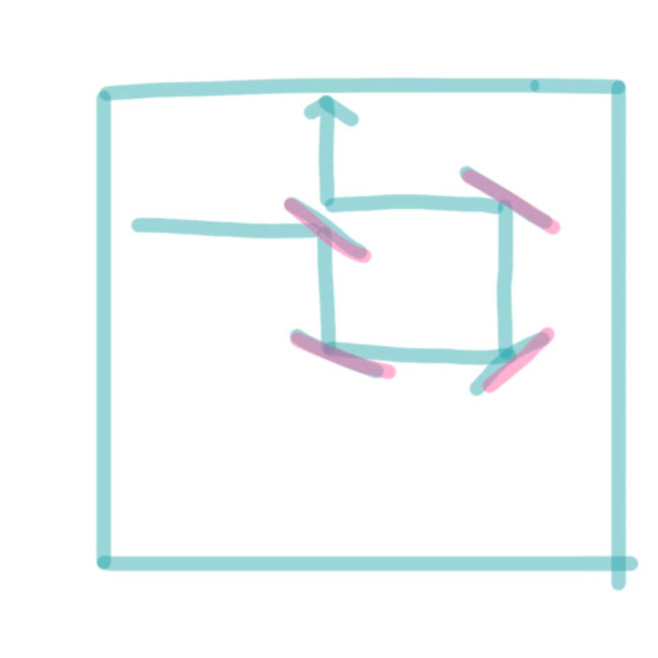
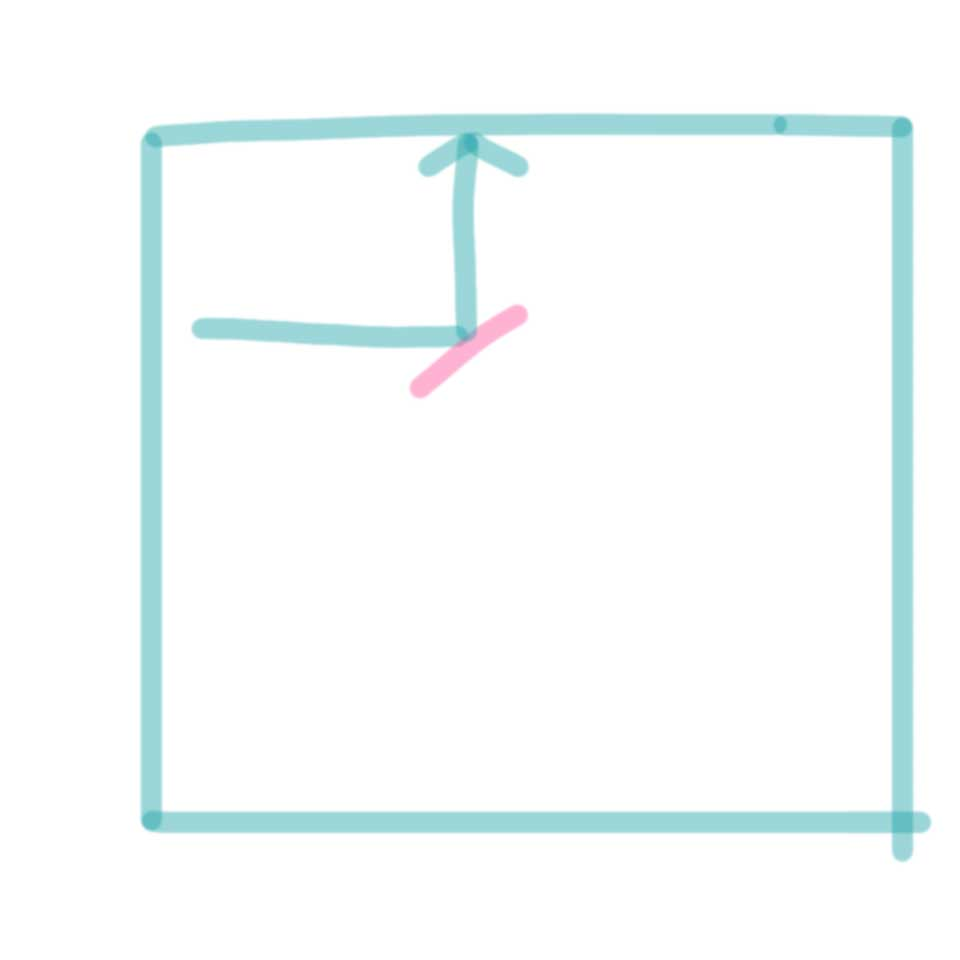

# 2023-07-31 ~ 2023-08-06 회고

### 문제 목록

- `11562` 백양로 브레이크
- `2151` 거울 설치
- `2812` 크게 만들기
- `14728` 벼락치기

### `11562` 백양로 브레이크

- dijkstra에에서 priority_queue는 greater로 해야한다.

  ```
  // solution.cpp line 9

  // Correct
  priority_queue<pair<int, int>, vector<pair<int, int> >, greater<pair<int, int> > > pq;


  // Wrong
  priority_queue<pair<int, int> > pq;

  ```

### `2151` 거울 설치

- 이 문제는 dfs로 풀면 시간초과

- % 연산은 결과가 음수로 나올 수 있다는 걸 명심하기

  ```
  // solution.cpp line 46

  // Correct
  visited[cur_r][cur_c][(cur_d + 3) % 4] = true;

  // Wrong
  visited[cur_r][cur_c][(cur_d - 1) % 4] = true;
  ```

- 거울 문제에서 돌고 돌아서 기존의 거울로 다시 들어가는 것은 무조건 느림
  
  

### `14728` 벼락치기

- 그냥 knapsack 문제
- knapsack 문제는 greedy 아니고 dp임;;

### `2812` 크게 만들기

- 그리디 어렵다
