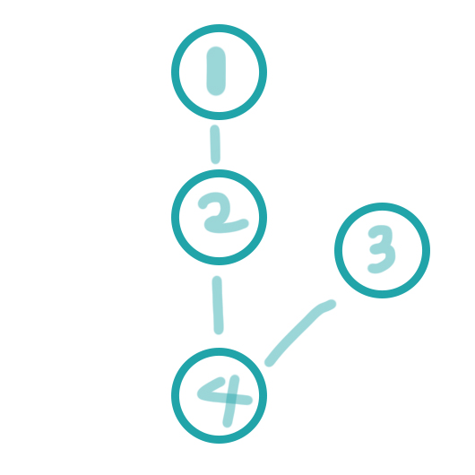

# 2023-08-14 ~ 2023-08-20 회고

### 문제 목록

- `1939` 중량제한
- `2662` 기업투자
- `2533` 사회망 서비스(SNS)
- `1949`

### `1939` 중량제한

- dijkstra와 이분탐색을 이용해서 풀이하였다.
- 이분탐색 시 양끝 값을 잘 정해줘야 한다. 해당 문제는 최대 무게를 구하는 것이었지만 풀이에서는 도달하지 못하는 최소 무게를 구한 뒤 -1 했기 때문에 끝 값이 `100,000,000` 이 아니라 `100,000,001`이어야 했다.

  ```
  // solution.cpp line 53

  // Correct
  int bi_st, bi_en, bi_mid;
  bi_st = 0;
  bi_en = 1000000001;
  while(bi_st < bi_en) {
    bi_mid = (bi_st + bi_en) / 2;
    // ...
  }


  // Wrong
  int bi_st, bi_en, bi_mid;
  bi_st = 0;
  bi_en = 1000000000;
  while(bi_st < bi_en) {
    bi_mid = (bi_st + bi_en) / 2;
    // ...
  }
  ```

### `2662` 기업투자

- dp를 이용해서 풀었다.

### `2533` 사회망 서비스(SNS)

- tree라서 그냥 재귀로 풀면 될 줄 알았으나 dp를 이용하여 재귀를 줄어야 시간초과가 나지 않았다.
- `num1 num2` 와 같은 input의 tree를 vector array형식으로 저장하려고 할 때 단순하게 앞에 오는 숫자의 child로 뒤에오는 숫자를 저장하였슨데 해당 방식은 다음과 같은 input에 대해 아래 그림과 같이 저장 되는 문제가 발생하였다.

  ```
  4
  1 2
  3 4
  2 4
  ```

  

  이에 서로를 각자의 child로 추가하고 탐색 시 visited 배열을 두어 확인하게 변경하였다.

  ```
  // solution.cpp line 37
  // 저장 부분

  // Correct
  for(int i = 0; i < n - 1; i++) {
    int a, b;
    cin >> a >> b;

    children[a - 1].push_back(b - 1);
    children[b - 1].push_back(a - 1);
  }

  // Wrong
  for(int i = 0; i < n - 1; i++) {
    int a, b;
    cin >> a >> b;

    children[a - 1].push_back(b - 1);
  }
  ```

  ```
  // solution.cpp line 15
  // 탐색 부분

  // Correct
  for(int i = 0; i < children[root].size(); i++) {
    if(visited[children[root][i]]) continue;
    dp[root][is_root_ea] += min(calc(children[root][i], 0), calc(children[root][i], 1));
  }

  // Wrong
  for(int i = 0; i < children[root].size(); i++) {
    dp[root][is_root_ea] += min(calc(children[root][i], 0), calc(children[root][i], 1));
  }
  ```
